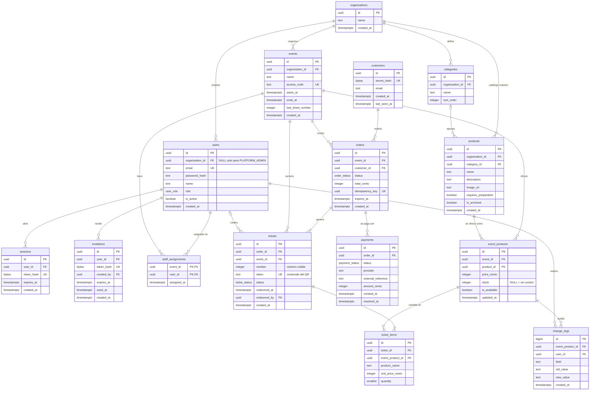

# Diagrama entidad-relación

Modelo de datos en PostgreSQL. Se crea con [`ddl.sql`](ddl.sql) y los datos de ejemplo están en [`dml-seed.sql`](dml-seed.sql). Los nombres de tablas y columnas están en inglés.



## Tipos enumerados

| Tipo | Valores |
|---|---|
| `user_role` | `PLATFORM_ADMIN` (administrador de la plataforma), `ORGANIZER` (organizador), `STAFF` |
| `order_status` | `PENDING_PAYMENT` (pendiente de pago), `PAID` (pagado), `REJECTED` (rechazado), `EXPIRED` (expirado) |
| `payment_status` | `PENDING` (pendiente), `APPROVED` (aprobado), `REJECTED` (rechazado) |
| `ticket_status` | `PENDING` (sin activar, antes del pago), `ACTIVE` (activo), `REDEEMED` (retirado) |

El estado del evento y el vencimiento del ticket no se guardan: los calculan las vistas `events_with_status` y `tickets_with_status` con la hora del servidor.

## Índices principales

Además de los índices de las claves primarias y de las restricciones `UNIQUE`:

| Índice | Para qué |
|---|---|
| `events (organization_id, starts_at)` | Listado de eventos del organizador |
| `event_products (event_id, product_id)` único | Catálogo del evento, sin productos repetidos |
| `orders (customer_id, created_at DESC)` | Mis tickets |
| `orders (expires_at)` parcial, solo pendientes | Liberar las reservas vencidas |
| `orders (customer_id)` único parcial, solo pendientes | Un solo pedido pendiente por cliente |
| `payments (order_id)` único parcial, solo aprobados | Un solo pago aprobado por pedido |
| `tickets (order_id)` | Tickets de cada compra |
| `tickets (token)` único | Canje |
| `tickets (event_id, number)` único | Número visible por evento |
| `tickets (event_id, status)` | Demanda pendiente |
| `ticket_items (event_product_id)` | Demanda pendiente por producto |

## Cómo se crea la base

```bash
psql "$DATABASE_URL" -f database/ddl.sql
psql "$DATABASE_URL" -f database/dml-seed.sql
```
