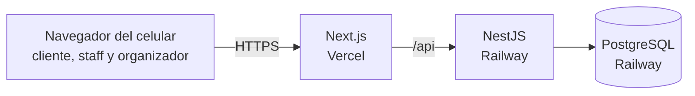

# Arquitectura del proyecto

## Arquitectura elegida

Aplicación web cliente-servidor con arquitectura en capas:

- **Frontend**: una sola aplicación Next.js con tres áreas: cliente, barra y Panel del Organizador.
- **Backend**: API REST en NestJS, organizada como monolito modular. Cada módulo (autenticación, eventos, pedidos, tickets, etc.) se divide en controlador, servicio y acceso a datos.
- **Base de datos**: PostgreSQL.

## Tecnologías

| Capa | Tecnología | Justificación |
|---|---|---|
| Frontend | Next.js + TypeScript (Vercel) | Carga rápida del catálogo al escanear el QR; HTTPS y deploy continuo incluidos. |
| Backend | NestJS + TypeScript (Railway) | Estructura modular y tipada; atiende compras simultáneas sin bloquearse. |
| Base de datos | PostgreSQL (Railway) | Transacciones para reservar stock y canjear tickets de forma atómica. |
| Acceso a datos | Prisma | Tipos generados desde el esquema y migraciones versionadas. |

## Decisiones técnicas

- **Monolito modular en vez de microservicios**: para un equipo de dos personas es más simple de desarrollar y desplegar, y los módulos mantienen el código ordenado.
- **Una sola app de frontend** para las tres áreas: comparten componentes y un único deploy.
- **El frontend reenvía `/api` al backend**: las cookies de sesión quedan en el mismo dominio y el navegador no las bloquea.
- **Stock y canje atómicos**: cada uno se resuelve con una sola sentencia `UPDATE` condicional. Si dos personas compran la última unidad o dos barras escanean el mismo QR a la vez, solo una operación se concreta.
- **Cliente sin cuenta**: se identifica con una cookie segura que emite el servidor. Organizadores y staff inician sesión con email y contraseña.
- **Varias productoras en la misma plataforma**: cada una ve solo sus datos, así el sistema se puede ofrecer como servicio.
- **Pagos simulados detrás de una interfaz**: Mercado Pago se puede sumar después sin cambiar el resto del sistema.
